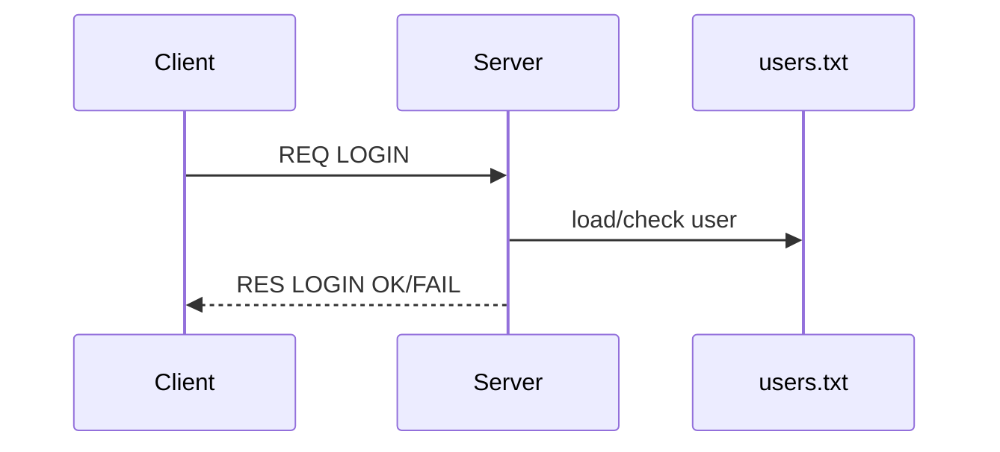
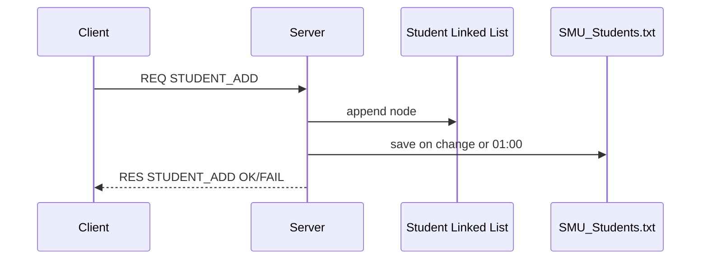

# 데이터 흐름

## 1. 로그인 흐름

```mermaid
sequenceDiagram
    participant C as Client
    participant S as Server
    participant U as users.txt
    C->>S: REQ LOGIN
    S->>U: load/check user
    S-->>C: RES LOGIN OK/FAIL
```

## 2. 학생 추가 흐름

```mermaid
sequenceDiagram
    participant C as Client
    participant S as Server
    participant L as Student Linked List
    participant F as SMU_Students.txt
    C->>S: REQ STUDENT_ADD
    S->>L: append node
    S->>F: save on change or 01:00
    S-->>C: RES STUDENT_ADD OK/FAIL
```

## 3. 학과 조회 흐름

서버는 연결 리스트를 순회하여 `department` 가 입력 학과명과 일치하는 학생 정보를 응답한다.
