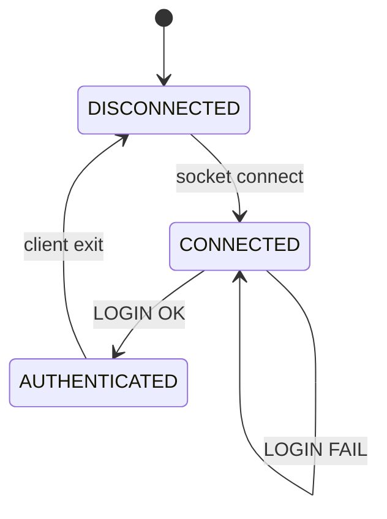

# 세션 수명주기

## 1. 상태

| 상태 | 설명 |
|------|------|
| DISCONNECTED | 클라이언트가 서버에 연결되지 않은 상태 |
| CONNECTED | 소켓 연결은 되었지만 로그인 전 상태 |
| AUTHENTICATED | 로그인 성공 후 학생정보 관리 기능 사용 가능 상태 |

## 2. 전이

## 3. 권한 기준

학생정보 관리 기능과 신규 사용자 추가 기능은 `AUTHENTICATED` 상태에서만 허용한다.
