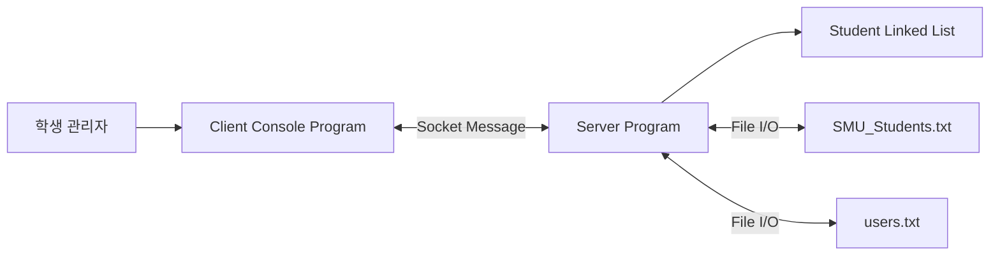

# 시스템 컨텍스트

## 1. 전체 구성

## 2. 책임 분리

| 구성요소 | 책임 |
|----------|------|
| Client | 사용자 명령 입력, 요청 송신, 서버 결과 출력 |
| Server | 학생정보 초기화, 요청 처리, 서비스 제공 |
| `SMU_Students.txt` | 학생정보 저장 |
| `users.txt` | 사용자 정보 저장 |
| Student Linked List | 서버 런타임 학생정보 관리 |
