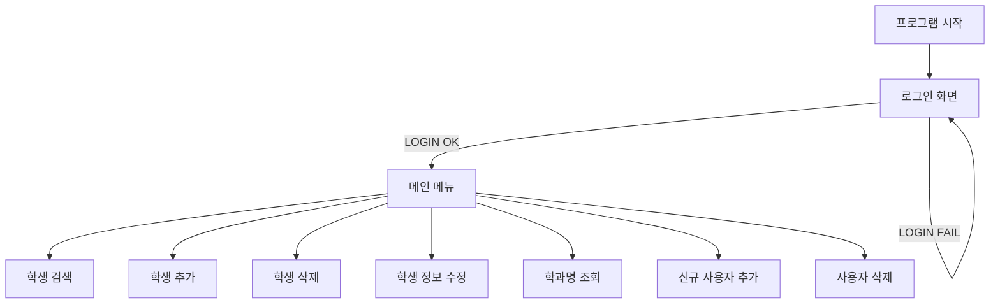

# 화면 흐름

```mermaid
flowchart TD
    A[프로그램 시작] --> B[로그인 화면]
    B -->|LOGIN OK| C[메인 메뉴]
    B -->|LOGIN FAIL| B
    C --> D[학생 검색]
    C --> E[학생 추가]
    C --> F[학생 삭제]
    C --> G[학생 정보 수정]
    C --> H[학과명 조회]
    C --> I[신규 사용자 추가]
    C --> J[사용자 삭제]
```

## 출력 기준

클라이언트는 서버 응답의 성공/실패 상태와 결과 데이터를 콘솔에 출력한다.
