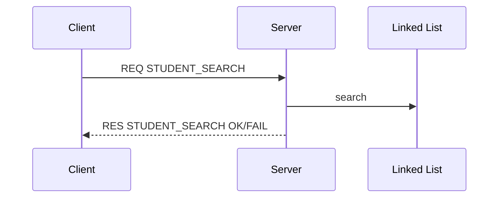
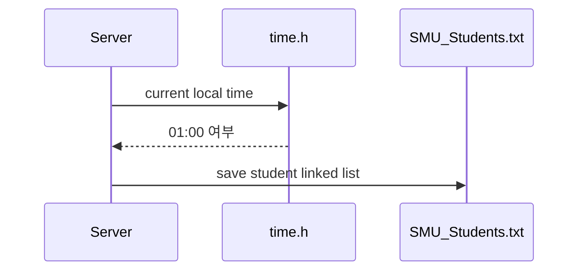

# 시퀀스 다이어그램

## 1. 학생 검색

```mermaid
sequenceDiagram
    participant C as Client
    participant S as Server
    participant L as Linked List
    C->>S: REQ STUDENT_SEARCH
    S->>L: search
    S-->>C: RES STUDENT_SEARCH OK/FAIL
```

## 2. 01:00 저장

```mermaid
sequenceDiagram
    participant S as Server
    participant T as time.h
    participant F as SMU_Students.txt
    S->>T: current local time
    T-->>S: 01:00 여부
    S->>F: save student linked list
```
